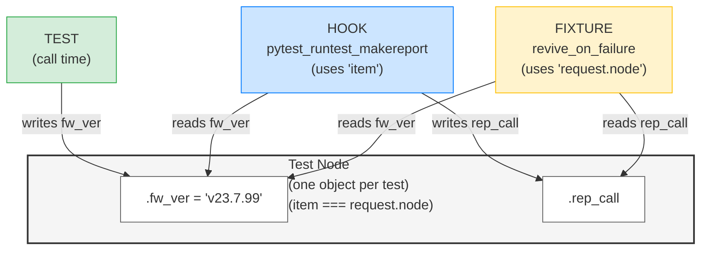
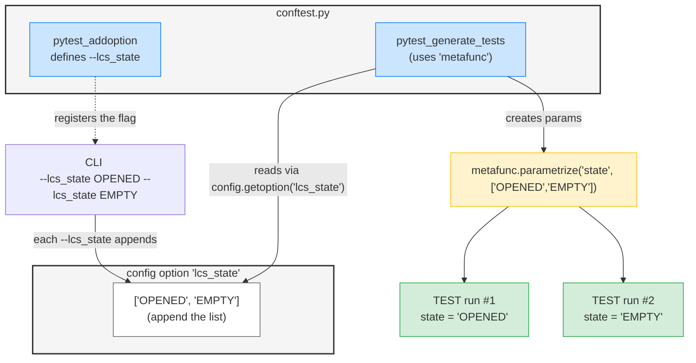
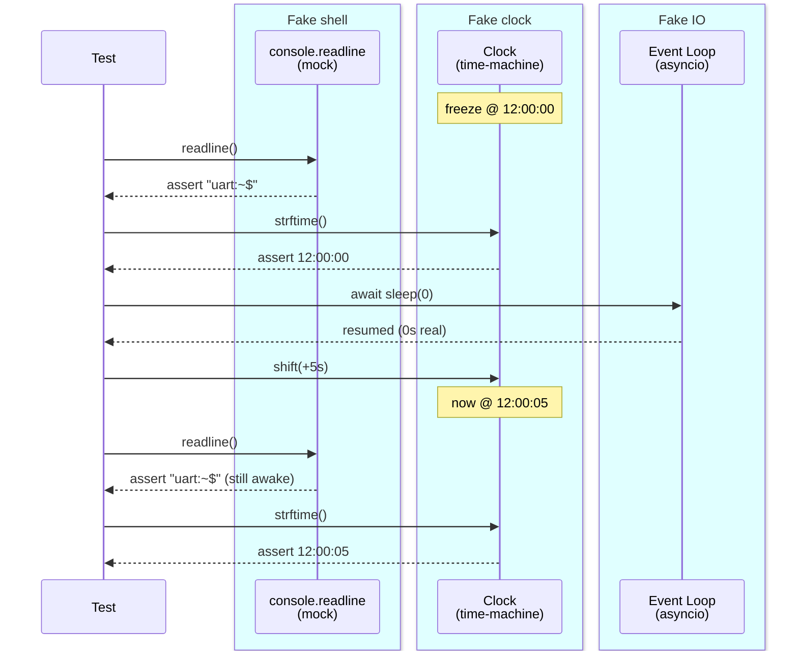
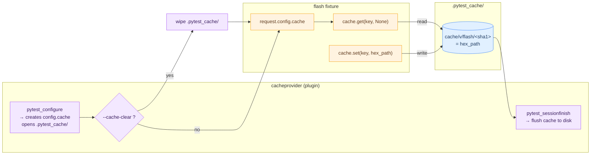

# Diagram

## Hook

```mermaid
flowchart TB
    subgraph NODE["Test Node<br/>(one object per test)<br/>(item === request.node)"]
        FW[".fw_ver = 'v23.7.99'"]
        REP[".rep_call"]
    end

    TEST["TEST<br/>(call time)"]
    HOOK["HOOK<br/>pytest_runtest_makereport<br/>(uses 'item')"]
    FIX["FIXTURE<br/>revive_on_failure<br/>(uses 'request.node')"]

    TEST -- "writes fw_ver" --> FW
    HOOK -- "reads fw_ver" --> FW
    FIX  -- "reads fw_ver" --> FW

    HOOK -- "writes rep_call" --> REP
    FIX  -- "reads rep_call" --> REP

    style NODE fill:#f5f5f5,stroke:#333,stroke-width:2px
    style TEST fill:#d4edda,stroke:#28a745
    style HOOK fill:#cce5ff,stroke:#007bff
    style FIX  fill:#fff3cd,stroke:#ffc107
    style FW fill:#ffffff,stroke:#666
    style REP fill:#ffffff,stroke:#666
```

## Parameterize

```mermaid
flowchart TB
    CLI["CLI <br/>--lcs_state OPENED --lcs_state EMPTY"]

    subgraph CONFTEST["conftest.py"]
        ADD["pytest_addoption<br/>defines --lcs_state"]
        GEN["pytest_generate_tests<br/>(uses 'metafunc')"]
    end

    subgraph CONFIG["config option 'lcs_state'"]
        LIST["['OPENED', 'EMPTY']<br/>(append the list)"]
    end

    PARAM["metafunc.parametrize('state', ['OPENED','EMPTY'])"]

    R1["TEST run #1<br/>state = 'OPENED'"]
    R2["TEST run #2<br/>state = 'EMPTY'"]

    CLI -- "each --lcs_state appends" --> LIST
    ADD -. "registers the flag" .-> CLI
    GEN -- "reads via config.getoption('lcs_state')" --> LIST
    GEN -- "creates params" --> PARAM
    PARAM --> R1
    PARAM --> R2

    style CONFTEST fill:#f5f5f5,stroke:#333,stroke-width:2px
    style CONFIG fill:#f5f5f5,stroke:#333,stroke-width:2px
    style ADD fill:#cce5ff,stroke:#007bff
    style GEN fill:#cce5ff,stroke:#007bff
    style LIST fill:#ffffff,stroke:#666
    style PARAM fill:#fff3cd,stroke:#ffc107
    style R1 fill:#d4edda,stroke:#28a745
    style R2 fill:#d4edda,stroke:#28a745
```

## Mock

```mermaid
sequenceDiagram
    participant T as Test
    box lightcyan Fake shell
        participant M as console.readline<br/>(mock)
    end
    box lightcyan Fake clock
        participant C as Clock<br/>(time-machine)
    end
    box lightcyan Fake IO
        participant L as Event Loop<br/>(asyncio)
    end
    Note over C: freeze @ 12:00:00
    T->>M: readline()
    M-->>T: assert "uart:~$"
    T->>C: strftime()
    C-->>T: assert 12:00:00 
    T->>L: await sleep(0)
    L-->>T: resumed (0s real)
    T->>C: shift(+5s)
    Note over C: now @ 12:00:05
    T->>M: readline()
    M-->>T: assert "uart:~$" (still awake)
    T->>C: strftime()
    C-->>T: assert 12:00:05
```

## Cache

```mermaid
flowchart LR
    subgraph HOOKS["cacheprovider (plugin)"]
        Config["pytest_configure<br/>→ creates config.cache<br/>opens .pytest_cache/"]:::hook
        Clear{"--cache-clear ?"}:::hook
        Finish["pytest_sessionfinish<br/>→ flush cache to disk"]:::hook
    end

    subgraph DISK[".pytest_cache/"]
        Store[("cache/v/flash/&lt;sha1&gt;<br/>= hex_path")]:::disk
    end

    subgraph FIXTURE["flash fixture"]
        Req["request.config.cache"]:::fix
        Get["cache.get(key, None)"]:::fix
        Set["cache.set(key, hex_path)"]:::fix
    end
    Config --> Clear
    Clear -->|yes| Wipe["wipe .pytest_cache/"]:::hook
    Clear -->|no| Req
    Wipe --> Req

    Req --> Get
    Get -->|read| Store
    Set -->|write| Store
    Store --> Finish

    classDef hook fill:#f3e8ff,stroke:#a855f7,color:#3a1e5f
    classDef fix fill:#fff3e0,stroke:#f59e0b,color:#5f3a1e
    classDef disk fill:#e1f0ff,stroke:#3b82f6,color:#1e3a5f
```
